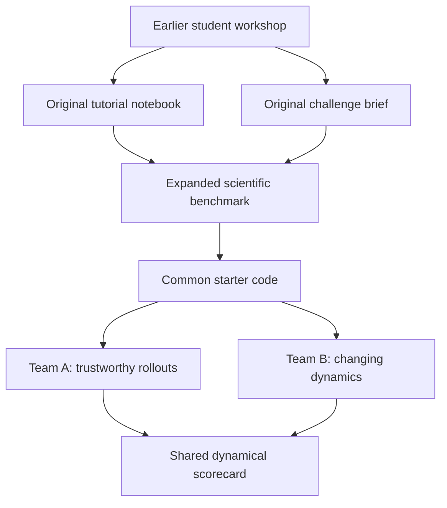

# MLESM Lorenz Dynamics Hackathon

This repository develops the MLESM hackathon challenge **When Is an AI Weather Model Dynamically Trustworthy?**

The challenge uses the Lorenz-63 system as a controlled laboratory for a question that also matters for AI weather and climate models:

> Two emulators can have similar one-step errors. How do we determine which one has learned a stable and scientifically credible dynamical system?

## How the pieces connect



The original workshop taught the full path from the Lorenz equations to a neural emulator. The proposed hackathon keeps that foundation but shifts the objective from simply obtaining a good one-step prediction to testing forecast horizon, rollout stability, perturbation growth, long-term statistics, and response to parameter changes.

## Start here

| If you want to understand... | Open... |
|---|---|
| What the earlier workshop contained | [`original_materials/`](original_materials/) |
| The proposed scientific rules and team questions | [`docs/benchmark_spec_v0.1.md`](docs/benchmark_spec_v0.1.md) |
| What has been decided and what remains open | [`docs/ROADMAP.md`](docs/ROADMAP.md) |
| How the implementation is organized | [`starter/README.md`](starter/README.md) |
| How the proposed workflow runs on JURECA | [`starter/JURECA_QUICKSTART.md`](starter/JURECA_QUICKSTART.md) |

## Repository structure

```text
.
├── original_materials/       # Unchanged PDF and teaching notebook
├── docs/                     # Organizer-facing scientific design
└── starter/                  # Provisional participant code and Slurm jobs
    ├── configs/              # Data and training experiment definitions
    ├── src/                  # Lorenz data, models, training, and evaluation
    ├── tests/                # Numerical and data-generation smoke tests
    ├── scripts/              # Multi-experiment helpers
    └── slurm/                # JURECA job scripts
```

## Proposed two-team structure

| Team | Main question | Required comparison |
|---|---|---|
| A: Learning the flow | What turns one-step skill into stable and dynamically faithful rollouts? | Direct next-state prediction vs residual prediction vs multi-step loss |
| B: Learning changing dynamics | Can a model learn a family of Lorenz systems and respond correctly when the control parameter changes? | State-only model vs parameter-conditioned model |

Both teams use the same data protocol and evaluation harness. This makes their conclusions comparable and allows them to exchange checkpoints for cross-evaluation.

## Current status

This is an **organizer draft**, not yet the final participant release.

- The scientific benchmark is a v0.1 proposal.
- Data generation and smoke tests have been checked locally.
- The complete PyTorch training and evaluation workflow still needs to be rehearsed on JURECA.
- The participant-facing one-page brief, pitch, event schedule, and final judging rubric have not yet been created.
- The original PDF and notebook are preserved unchanged.

The next design step is to review and agree on the benchmark in plain language before polishing the participant materials.

