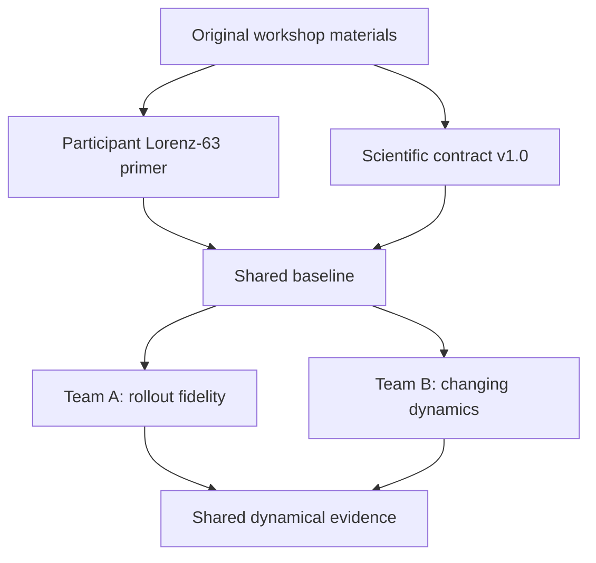

# MLESM Lorenz Dynamics Hackathon

## Beyond Predictive Skill: What Evidence Supports Claims of Learned Dynamics?

**Pitch hook:** *Same One-Step Error. Different Dynamics.*

This challenge uses Lorenz-63 as a controlled scientific testbed for evaluating AI emulators. Two models can achieve similar one-step errors yet differ strongly in autoregressive stability, perturbation growth, long-term behaviour, and response to changed forcing.

The challenge therefore asks:

> **What evidence supports the claim that an AI emulator has learned the underlying dynamics rather than only an accurate one-step mapping?**

The repository is currently an **organizer preparation branch**, not the frozen participant release.

## How the pieces connect



The original workshop introduced the path from the Lorenz equations to a neural emulator. The hackathon retains that foundation but shifts the objective from obtaining a good one-step prediction to testing progressively stronger evidence of dynamical fidelity.

## Start here

| If you want to understand... | Open... |
|---|---|
| Lorenz-63, its physical meaning, chaos, and AI emulation | [`docs/lorenz63_primer.md`](docs/lorenz63_primer.md) |
| The finalized scientific question, team scope, and required outputs | [`docs/scientific_challenge_contract_v1.0.md`](docs/scientific_challenge_contract_v1.0.md) |
| What is complete and what must happen before release | [`docs/ROADMAP.md`](docs/ROADMAP.md) |
| The provisional implementation and commands | [`starter/README.md`](starter/README.md) |
| The proposed JURECA workflow | [`starter/JURECA_QUICKSTART.md`](starter/JURECA_QUICKSTART.md) |
| The earlier challenge brief and teaching notebook | [`original_materials/`](original_materials/) |

The scientific contract v1.0 is the authority for the challenge scope. The older benchmark v0.1 is retained temporarily as a provisional implementation draft and must not override the contract.

## Lean two-team investigation

Both teams first reproduce the same numerical reference, persistence and linear baselines, and direct one-step MLP.

| Team | Primary question | Mandatory controlled comparison |
|---|---|---|
| **A: Rollout fidelity** | Does training through several autoregressive steps improve rollout fidelity, and what does it sacrifice? | Direct next-state MLP with one-step loss versus the same model with closed-loop multi-step loss |
| **B: Changing dynamics** | Is exposure to multiple regimes sufficient, or must the governing parameter be supplied explicitly? | State-only versus state-plus-$\rho$ models trained on identical multi-$\rho$ data |

The challenge is not an architecture competition. Each team must complete its mandatory comparison before attempting optional extensions.

## Common evidence

The shared evaluation harness examines:

- one-step error and forecast error versus lead time;
- rollout stability and attractor behaviour;
- long-term state distributions;
- perturbation growth for Team A; and
- response to changed $\rho$ for Team B.

There is no single overall model score.

## Repository structure

```text
.
├── original_materials/       # Unchanged challenge PDF and teaching notebook
├── docs/                     # Scientific contract, primer, and organizer roadmap
└── starter/                  # Provisional code, configurations, tests, and Slurm jobs
    ├── configs/              # Data and training experiment definitions
    ├── src/                  # Lorenz data, models, training, and evaluation
    ├── tests/                # Numerical and data-generation smoke tests
    ├── scripts/              # Multi-experiment helpers
    └── slurm/                # JURECA job scripts
```

## Current status

Completed:

- scientific challenge contract v1.0;
- participant-facing Lorenz-63 primer;
- original-material preservation;
- preliminary RK4, data, model, training, evaluation, test, and Slurm infrastructure.

Still required before the public release on **18 August 2026**:

1. align the Team A and Team B configurations with contract v1.0;
2. rehearse the complete workflow on JURECA;
3. freeze numerical settings, datasets, checksums, and runtime limits;
4. simplify and verify participant commands;
5. select an open-source licence;
6. complete the participant schedule and result templates; and
7. run a clean-account organizer rehearsal.

The immediate next technical step is **configuration alignment**, followed by the first complete JURECA rehearsal.
