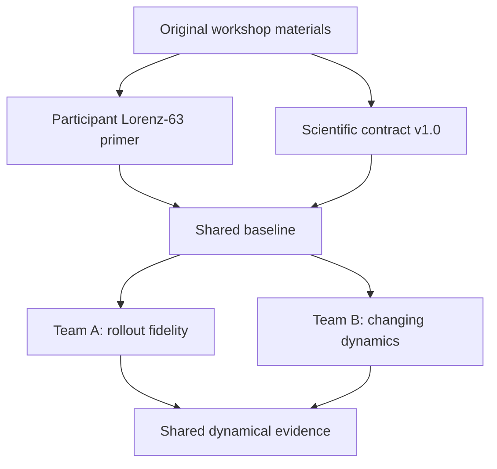

# MLESM Lorenz Dynamics Hackathon

## Beyond Predictive Skill: What Evidence Supports Claims of Learned Dynamics?

**Pitch hook:** *Same One-Step Error. Different Dynamics.*

This challenge uses Lorenz-63 as a controlled scientific testbed for evaluating AI emulators. Two models can achieve similar one-step errors yet differ strongly in autoregressive stability, perturbation growth, long-term behaviour, and response to changed forcing.

The challenge therefore asks:

> **What evidence supports the claim that an AI emulator has learned the underlying dynamics rather than only an accurate one-step mapping?**

The scientific and numerical benchmark has been rehearsed on JURECA-DC. The
repository contains participant-facing definitions and reproducible workflows;
private organizer rehearsal results are not part of the release.

## How the pieces connect



The original workshop introduced the path from the Lorenz equations to a neural emulator. The hackathon retains that foundation but shifts the objective from obtaining a good one-step prediction to testing progressively stronger evidence of dynamical fidelity.

## Start here

| If you want to understand... | Open... |
|---|---|
| Lorenz-63, its physical meaning, chaos, and AI emulation | [`docs/lorenz63_primer.md`](docs/lorenz63_primer.md) |
| The finalized scientific question, team scope, and required outputs | [`docs/scientific_challenge_contract_v1.0.md`](docs/scientific_challenge_contract_v1.0.md) |
| The exact datasets, training settings, checksums, and evaluation settings | [`docs/frozen_benchmark_v1.0.md`](docs/frozen_benchmark_v1.0.md) |
| What every diagnostic means and why it is evidence | [`docs/evaluation_evidence_guide.md`](docs/evaluation_evidence_guide.md) |
| Team A's mandatory comparison and commands | [`docs/team_a_rollout_fidelity.md`](docs/team_a_rollout_fidelity.md) |
| Team B's mandatory comparison and commands | [`docs/team_b_changing_dynamics.md`](docs/team_b_changing_dynamics.md) |
| The 2.5-day workflow and scientific gates | [`docs/participant_schedule.md`](docs/participant_schedule.md) |
| The copy-paste JURECA commands, job monitoring, and output locations | [`docs/commands_and_outputs.md`](docs/commands_and_outputs.md) |
| The experiment, result, and presentation templates | [`docs/templates/`](docs/templates/) |
| What is complete and what must happen before release | [`docs/ROADMAP.md`](docs/ROADMAP.md) |
| The implementation and commands | [`starter/README.md`](starter/README.md) |
| The rehearsed JURECA workflow | [`starter/JURECA_QUICKSTART.md`](starter/JURECA_QUICKSTART.md) |
| The earlier challenge brief and teaching notebook | [`original_materials/`](original_materials/) |

The scientific contract v1.0 is the authority for scope. Frozen Benchmark
v1.0 is the authority for numerical settings. The older benchmark v0.1 is only
a historical pointer and must not override either document.

## Lean two-team investigation

Both teams first reproduce the same numerical reference, persistence and linear baselines, and direct one-step MLP.

| Team | Primary question | Mandatory controlled comparison |
|---|---|---|
| **A: Rollout fidelity** | Does training through several autoregressive steps improve rollout fidelity, and what does it sacrifice? | Direct next-state MLP with one-step loss versus the same model with closed-loop four-step loss |
| **B: Changing dynamics** | Is exposure to multiple regimes sufficient, or must the governing parameter be supplied explicitly? | State-only versus state-plus-$\rho$ models trained on identical multi-$\rho$ data |

The challenge is not an architecture competition. Each team must complete its mandatory comparison before attempting optional extensions.

## Common evidence

The shared evaluation harness examines:

- one-step error and forecast error versus lead time;
- numerical finiteness, broad boundedness, and long-term variance;
- perturbation-growth curves and finite-time effective growth rates;
- long-term state distributions, lobe occupancy, switching, and residence;
- in-distribution, interpolation, and extrapolation response across $\rho$.

The [evaluation evidence guide](docs/evaluation_evidence_guide.md) defines every
quantity and its limitations. There is no single overall model score.

## Repository structure

```text
.
├── original_materials/       # Unchanged challenge PDF and teaching notebook
├── docs/                     # Contract, frozen benchmark, team guides, and templates
└── starter/                  # Code, configurations, tests, and Slurm jobs
    ├── configs/              # Data and training experiment definitions
    ├── src/                  # Lorenz data, models, training, and evaluation
    ├── tests/                # Smoke tests and controlled-comparison contract tests
    ├── scripts/              # Multi-experiment helpers
    └── slurm/                # JURECA job scripts
```

## Release status

The complete data, training, and evaluation workflow has been rehearsed on
JURECA-DC. Numerical settings, dataset checksums, Team A's four-step horizon,
Team B's parameter regimes, and evaluator failure policies are frozen. The
remaining release gate is a clean participant-like checkout rehearsal,
tracked in the [organizer roadmap](docs/ROADMAP.md).

## License

This repository is licensed under the
[Apache License 2.0](LICENSE). The licence applies to the entire repository,
including the preserved PDF and notebook in [`original_materials/`](original_materials/).
See [`NOTICE`](NOTICE) for attribution information.
