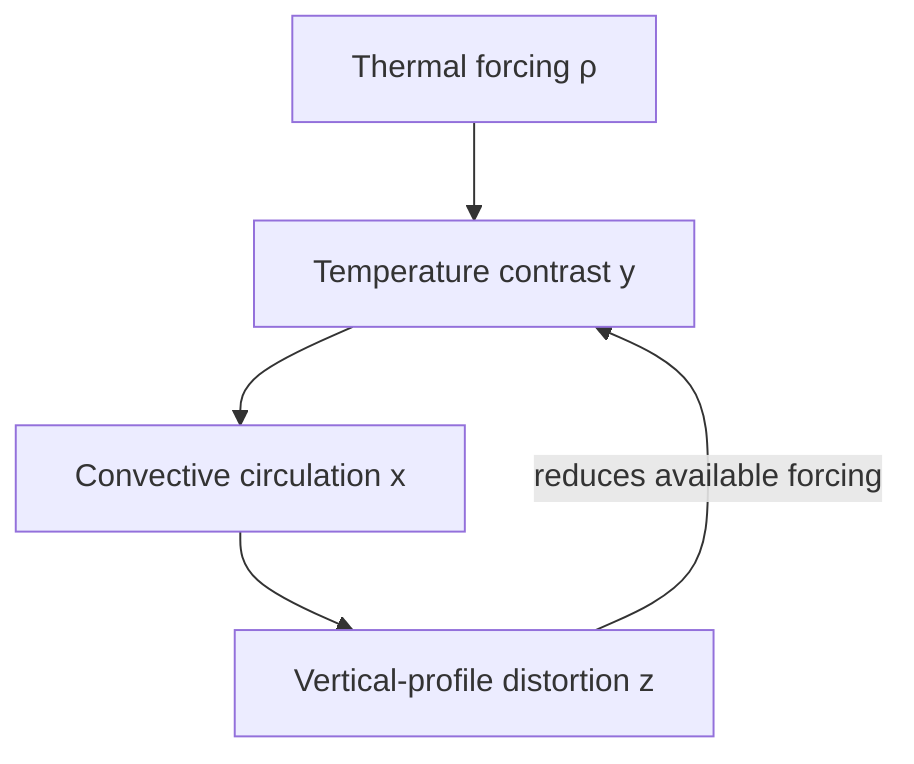

# Lorenz-63: From Thermal Convection to an AI Emulator

**Reading time:** 10–15 minutes
**What you need to learn:** what the three variables represent, why the system is chaotic, what the two-lobed attractor means, and why accurate one-step prediction is not enough.

## 1. The physical picture

Imagine a shallow layer of fluid that is **heated from below and cooled from above**.

- Warm fluid near the bottom becomes buoyant and rises.
- Cooler fluid near the top sinks.
- Together, these motions can form an overturning circulation, or **convective roll**.
- The circulation transports heat and changes the temperature structure that created the motion.

This final point is essential: the motion changes its own driving conditions. Lorenz-63 is a minimal model of this feedback.

It is **not** a miniature atmospheric model. It has no map, clouds, pressure levels, or spatial grid. Its value is that three coupled variables are enough to demonstrate nonlinearity, feedback, instability, and limited predictability—the same concepts that make weather prediction difficult.

## 2. The three state variables

At any time, the system state is

$$
\mathbf{s}(t)=[x(t),y(t),z(t)].
$$

| Variable | Physical interpretation |
|---|---|
| $x$ | Strength and direction of the convective circulation. Its magnitude measures the circulation strength; its sign distinguishes the two circulation orientations. |
| $y$ | Horizontal temperature contrast between the rising and sinking parts of the circulation. |
| $z$ | Distortion of the vertical temperature profile away from the motionless, purely conductive state. |

These variables are idealized amplitudes, not direct measurements in kelvin or metres per second.

## 3. The Lorenz equations

The state evolves according to

$$
\begin{aligned}
\frac{dx}{dt} &= \sigma(y-x),\\
\frac{dy}{dt} &= x(\rho-z)-y,\\
\frac{dz}{dt} &= xy-\beta z.
\end{aligned}
$$

Read the equations as a feedback loop:

1. **Temperature contrast drives circulation.** The first equation pulls $x$ toward $y$.
2. **Circulation acts on the temperature contrast.** In the second equation, $x(\rho-z)$ couples the motion to the available thermal forcing, while $-y$ damps the contrast.
3. **Heat transport changes the vertical temperature structure.** The interaction $xy$ modifies $z$, while $-\beta z$ relaxes that distortion.
4. **The changed vertical structure feeds back on the circulation.** A larger $z$ reduces the available forcing $\rho-z$ in the second equation.



The parameters control the system rather than describe its instantaneous state:

| Parameter | Role |
|---|---|
| $\sigma$ | How quickly the circulation responds; related to the ratio of momentum and thermal diffusion. |
| $\rho$ | Strength of heating from below—the main control parameter in this challenge. |
| $\beta$ | Damping and geometric influence in the vertical-temperature equation. |

The standard chaotic configuration is

$$
\sigma=10,\qquad \rho=28,\qquad \beta=\frac{8}{3}.
$$

## 4. Deterministic does not mean predictable forever

Lorenz-63 is **deterministic**: an exact initial state and the equations uniquely determine the future.

It can also be **chaotic**: two almost identical initial states can separate rapidly. The system does not become random; instead, its nonlinear dynamics amplify tiny differences.

This is the connection to weather forecasting:

- atmospheric observations and analyses are never exact;
- small initial uncertainties grow;
- forecasts therefore lose pointwise accuracy with lead time; and
- ensembles are used to sample this growing uncertainty.

When comparing two forecasts, early separation can therefore reflect both model error and the system's natural instability.

## 5. What is the Lorenz attractor?

At the standard parameters, a long trajectory forms the familiar two-lobed **Lorenz attractor**.

- In one lobe, $x$ and $y$ are mainly positive. This represents the idealized convective roll circulating in one direction.
- In the other lobe, $x$ and $y$ are mainly negative. This represents the same roll circulating in the opposite direction.
- The trajectory may circle one lobe several times and then cross to the other. This crossing is a **lobe switch** and represents a reversal of the idealized circulation direction.
- The trajectory remains bounded and structured but never repeats exactly. We cannot reliably predict how many loops it will complete before the next lobe switch.

For this challenge, treat the lobes simply as two recurring regions of Lorenz state space. We can measure how much time a model spends in each lobe and how often it switches between them. The lobes are not specific atmospheric weather types and should not be given a literal meteorological interpretation.

Short-range evaluation asks whether a model follows the correct trajectory. Long-range evaluation asks a different question: does it remain on a realistic attractor and visit its regions with realistic frequencies?

## 6. Why changing $\rho$ changes the dynamics

The parameter $\rho$ represents thermal forcing. Changing it does not merely shift the data distribution; it changes the equations that determine the next tendency and can change the system's long-term behaviour.

Suppose the state $(x,y,z)$ is held fixed while $\rho$ changes from $\rho_1$ to $\rho_2$. The change in the $y$ tendency is

```math
\Delta\left(\frac{dy}{dt}\right)
=
\left(\frac{dy}{dt}\right)_{\rho_2}
-
\left(\frac{dy}{dt}\right)_{\rho_1}
=
x(\rho_2-\rho_1).
```

In plain language: the same values of $x$, $y$, and $z$ can evolve differently under different thermal forcing. A state-only emulator is not told which value of $\rho$ governs the system. A parameter-conditioned emulator receives this missing information explicitly.

Near a parameter value where the system changes from one type of long-term behaviour to another, a short simulation can be deceptive. For example, a trajectory may switch irregularly between the lobes for some time but eventually settle into one steady circulation state. This temporary early behaviour is called a **transient**.

The reference simulations will therefore have two parts:

1. **Burn-in:** run the solver for an initial period and exclude these adjustment steps from the statistics.
2. **Evaluation period:** continue the simulation long enough to determine whether the sustained behaviour is chaotic, periodic, or steady and to estimate its long-term distribution.

The supplied evaluation code will handle both periods consistently for all models.

## 7. From equations to an AI emulator

A numerical solver advances the equations from one state to the next:

$$
\mathbf{s}_{n+1}=\mathcal{M}_{\mathrm{physics}}(\mathbf{s}_n).
$$

The baseline neural network does not receive the Lorenz equations. It learns a discrete approximation from example pairs:

$$
\widehat{\mathbf{s}}_{n+1}=\mathcal{M}_{\mathrm{AI}}(\mathbf{s}_n).
$$

During **one-step evaluation**, the model receives a true reference state at every example. During an **autoregressive rollout**, its own prediction becomes the next input:

$$
\mathbf{s}_0\rightarrow\widehat{\mathbf{s}}_1
\rightarrow\widehat{\mathbf{s}}_2
\rightarrow\widehat{\mathbf{s}}_3\rightarrow\cdots
$$

Each small error therefore changes the next input. Errors may accumulate, interact with the model's learned feedbacks, and then be amplified by chaos. Two models with similar one-step errors can consequently produce very different rollouts.

## 8. What evidence will we examine?

No single diagnostic proves that an emulator has learned the dynamics. The hackathon combines complementary tests:

| Evidence | Question |
|---|---|
| One-step error | Can the model predict the immediate next state? |
| Error versus lead time | How long does an autoregressive forecast remain useful? |
| Rollout stability | Does the trajectory remain finite and Lorenz-like, or explode, collapse, or drift? |
| Long-term distribution | Does the model visit the attractor's regions with realistic frequencies? |
| Perturbation growth | Does Team A's model reproduce the system's local instability, rather than being too unstable or too smooth? |
| Response to $\rho$ | Does Team B's model reproduce changing dynamics when the thermal forcing changes? |

## 9. How this connects to the two teams

- **Team A:** compare one-step training with closed-loop multi-step training and test whether rollout fidelity improves without producing overly smooth or otherwise distorted dynamics.
- **Team B:** compare state-only and $\rho$-conditioned models trained on the same multi-regime data and test whether explicit forcing information improves the response to changed dynamics.

## 10. The central idea to carry into the challenge

> **A small one-step error shows that an emulator predicts nearby states well. It does not, by itself, show that repeated predictions preserve the system's feedbacks, instability, long-term behaviour, or response to changed forcing.**

That gap between immediate predictive skill and stronger dynamical evidence is the scientific focus of the hackathon.
